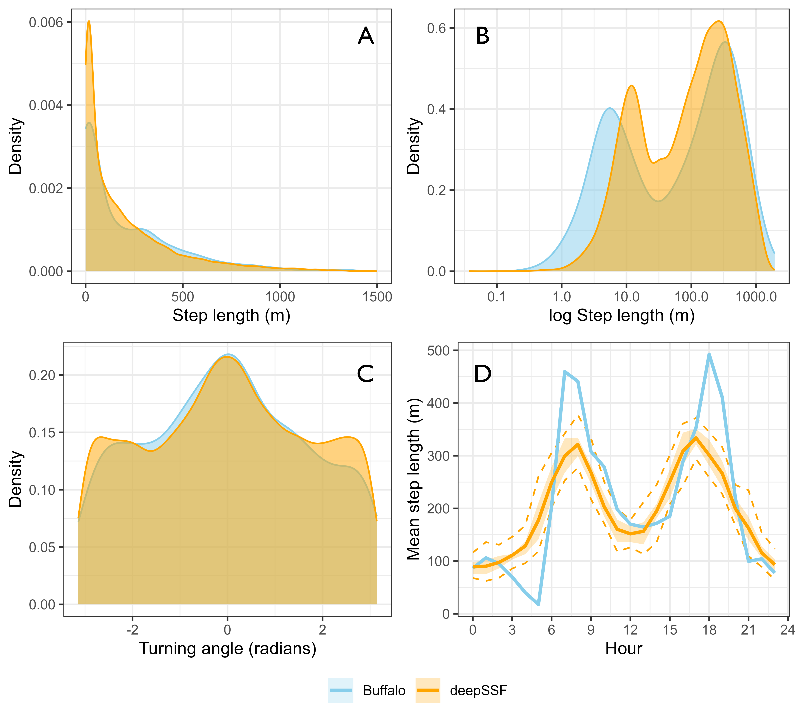
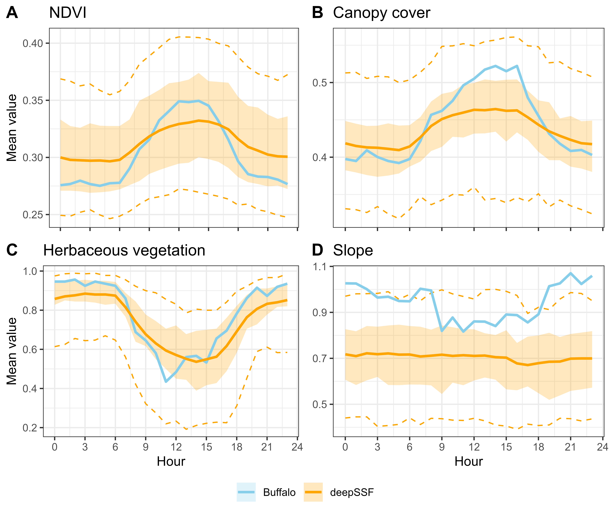

# DeepSSF ISBE2024
Additional details to accompany a poster titled 'Predicting animal movement with deepSSF: a deep learning step selection framework

## Summaries of the movement behaviour from the deepSSF simulations

A comparison of the step length (panels A and B) and turning angle distributions (panel C), and the mean step length for each hour of the day (panel D), between the observed (light blue) and simulated trajectories (orange). We simulated 50 trajectories that covered a three-month period of the late-dry season 2018, resulting in 2160 steps. These simulated locations were compared against the observed movement data for that period. The mixture distributions predicted from the movement parameters in the deepSSF model were able to capture the bimodal pattern of the observed step lengths, and closely represented the observed distribution of turning angles, which is not able to be captured neatly by a standard von Mises distribution. The deepSSF captures the temporal dynamism in the observed movement dynamics, although does not replicate the peaks of movement around dawn and dusk as strongly as in the observed data.

## Summaries of the hourly habitat selection behaviour from the deepSSF simulations

To assess the temporally dynamic habitat use of the simulated trajectories, we binned all simulated (orange) and observed (blue) steps into the hours of the day, and compared the mean values of each covariate at each hour of the day. We simulated 50 trajectories that covered a three-month period of the late-dry season 2018, resulting in 2160 steps, and we took a subset of the observed data to cover the same period. The deepSSF model was able to capture the hourly temporal dynamics in animal movement, similar to the results of temporally dynamic step selection functions in Forrest, Pagendam, et al. (2024). The shaded ribbons enclose the 25% and 75% quantiles, and the dashed lines are the 2.5% and 97.5% quantiles. The solid line is the mean for that hour across all trajectories or for the buffalo data. The deepSSF model captured the temporally dynamic habitat selection well for Normalised Difference Vegetation Index (NDVI), canopy cover and herbaceous vegetation, although the trend was not as clear for slope (although only a small range of slope values are shown on this plot).

# Animations of a simulated animal 'exploring' a landscape

## Habitat selection predictions
The simulated animal is in the centre of the landscape, and at each step the local landscape is evaluated for its suitability. 

## Step selection predictions
The simulated animal is in the centre of the landscape, and at each step the local landscape is evaluated for its suitability, which is combined with the learned movement dynamics of the animal.

## Landscape-scale predictions
As convolution filters are fixed in size and apply transformations uniformly across grids, they can be applied to any landscape extent to approximate habitat selection (without accounting for movement dynamics). Here we show habitat selection across the hours of the day in the late-dry season.

### For further details or a copy of the paper that was submitted for peer-review contact Scott Forrest at scott.forrest@hdr.qut.edu.au.
